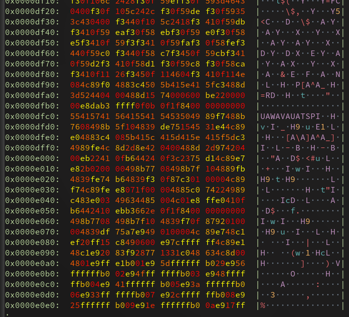
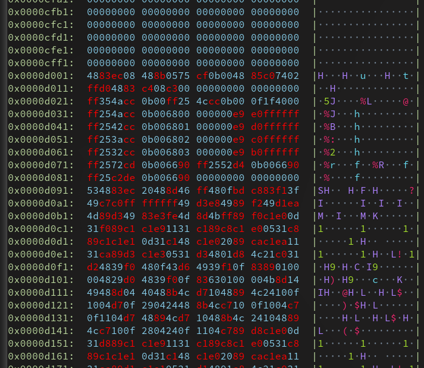

`0x` - like `xxd` but colorful!
==========

*Note: for technical reasons, this library is listed as `ohx` on crates.io.*



`0x` is a simple utility similar to `xxd` with a few nice features:
- Colorized output, with configurable output colors!
- Support for printing in bases 2, 4, 8, 16, 32, and 64.
- A small RPN calculator for picking how to color code bytes.

For example, to print all bytes with the sign bit set in red and all others in
blue, use `-x` to shift in sign bits, and colorize based on that.

```sh
0x -x '>>>7' -z skyblue,red my_file
```

The result is something like this (here `0x` is dumping itself):



---

`0x` tries to mimic `xxd`'s command-line interface where possible, although we
cannot promise full fidelity.